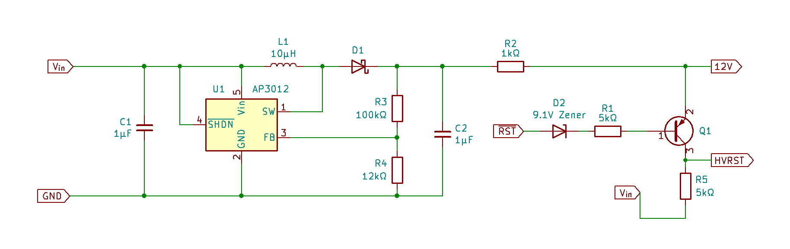
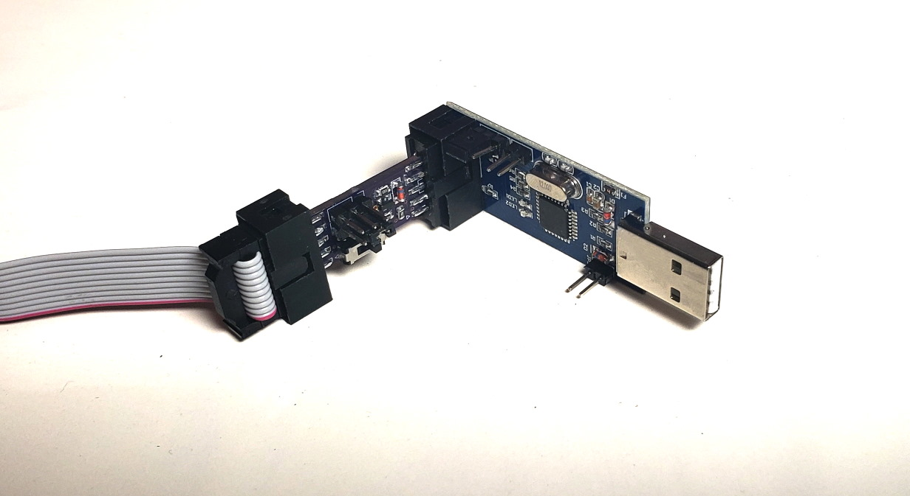
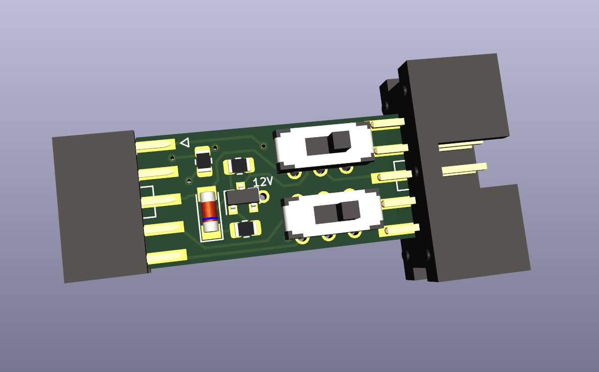
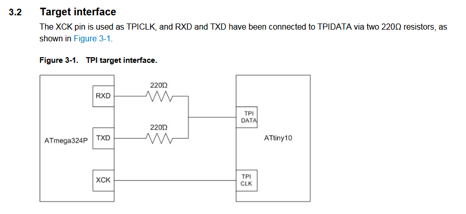
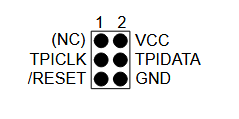
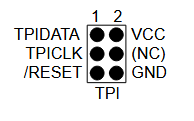
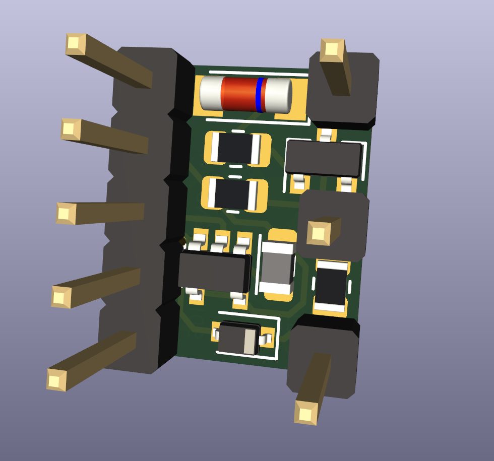
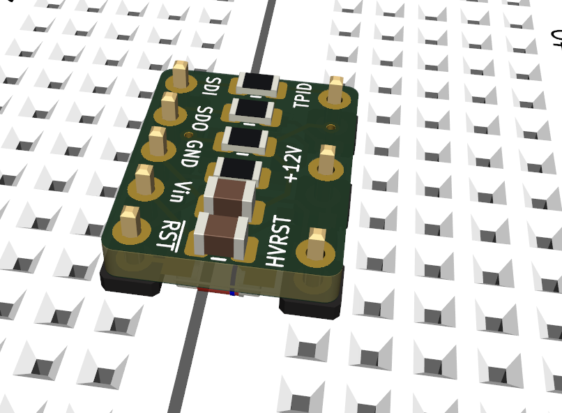
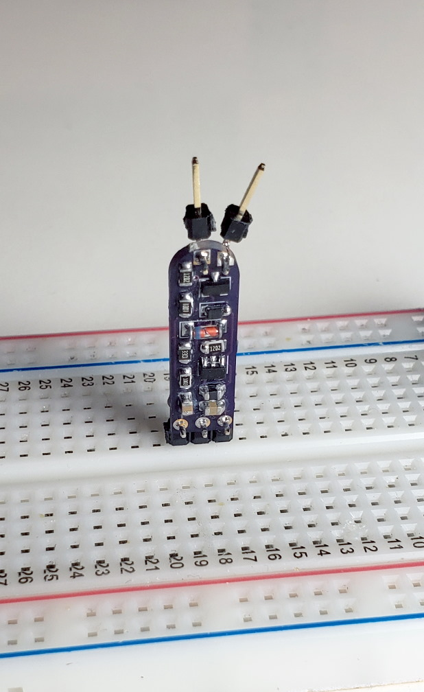

# High-Voltage Tiny Programming Interface (HVTPI) Tool

For an upcoming project I needed a way to use the High-Voltage Tiny Programming Interface (HVTPI) protocol. If you're at all familiar with the High-Voltage Serial Programming (HVSP) that can be used on most ATmegas and ATtinys that use the SPI protocol, then you would be justified to assume HVTPI is a convoluted process dissimilar from standard TPI. But, mercifully, that is not the case! HVTPI is just TPI, but instead of pulling the RESET pin LOW, you pull it up to 12V.

Two low-cost options for TPI programming are the [USBasp](https://www.fischl.de/usbasp/) (with the [latest firmware](https://blog.podkalicki.com/how-to-update-avr-usbasp-firmware-to-latest-version/)) or the [TPI Programming Arduino Sketch](http://junkplusarduino.blogspot.com/p/attiny10-resources.html) by Junk+Arduino and others. Neither the USBasp nor the Arduino has a pin available to output 12V, of course. That requires some extra hardware.

The task is easy to summarize. Create a new signal that produces 5V when RESET produces 5V, and goes to 12V when RESET goes to 0V. On YouTube, [fVripple made a very good one with an optoisolator and a benchtop power supply](https://www.youtube.com/watch?v=7YJOtHbnNDQ), but I wanted to stick to parts I had on-hand and make it more portable. This is what I came up with:

An AP3012 boost converter gives us 12V all the time. While RESET is HIGH, the forward voltage of the Zener diode is high enough that no current flows through the PNP BJT and the output is equal to RESET. When RESET goes LOW, current flows through the 9.1V Zener diode, driving the output to 12V. The 5kΩ resistor value is not a precise one; I think I used 3.3kΩ in practice. And I broke out the 12V signal in case I ever wanted to use it for something else, I dunno what though.

To actually use this schematic, I made two designs: one to go with the USBasp and one to go with the Arduino TPI programmer. I was very sleep-deprived and made some silly design choices.

## The USBasp HVTPI tool

The USBasp HVTPI tool mates nicely with its 2×5 IDC headers. There are two SPDT switches, one to switch between normal TPI and HVTPI modes, and another to combine the two data lines as described in [this application note](http://ww1.microchip.com/downloads/en/AppNotes/doc8373.pdf)

These resistors are not always necessary, which is why they can be disconnected with the switch. The USBasp expects a circuit with a programming pinout like this:

Consequently, the line that is normally labelled "MOSI" acts as the bidirectional line when the USBasp does TPI stuff. This becomes a problem if you are using a circuit that was designed for the [Atmel-ICE](https://ww1.microchip.com/downloads/en/DeviceDoc/Atmel-ICE_UserGuide.pdf), which expects a programming pinout like this:

Both configurations are handled equally well by the 220Ω-resistor switch.

Using the HVTPI tool is as easy as normal TPI. As far as your computer is concerned, there is no difference between this and a normal TPI setup, so no instructions or makefiles have to change.

## The Arduino HVTPI tool

The Arduino-compatible programmer is designed to sit in a breadboard. I originally designed it very skinny, with the HVRST line sticking up like so:

This is not very helpful, so later I went back and put it in a more reasonable 10-DIP layout. Because the Arduino program expects both MISO and MOSI lines to connect to the TPI DATA line via 220Ω resistors, I built that into this board as well. Again, there is no need to make any changes to the normal TPI programming workflow. I know the Arduino sketch has some "HVP" options available, but with this board they are wholly unnecessary.